# memirutku

**Dil &nbsp;·&nbsp; Language:** [**Türkçe**](#türkçe) &nbsp;|&nbsp; [**English**](#english)

Yapay zekâ destekli uygulamalar · *AI systems, agents, and full-stack product builds.*  
Telekom ve oyun/altyapı senaryoları üzerine üretim odaklı repolar.

  

---

&nbsp;

  

  

  

  
  
  
  
  
  
  
  

 

  

<table align="center" cellpadding="0" cellspacing="12" border="0">
  <tr>
    <td align="center" valign="top">
      
    </td>
    <td align="center" valign="top">
      
    </td>
  </tr>
</table>

---

## Türkçe

Yazılım ve yapay zekâ alanında **üretim tarafı** (ürün, API, ajan, RAG, MCP) ile ilgileniyorum.  
Aşağıdaki repolar, portföy ve teknik tekrar edilebilirlik için **public** tutulmaktadır (bazıları yarışma / staj vaka çalışması kökenlidir; ilgili README’lere bakın).

### Öne çıkan repolar

| Repo | Kısaca ne | Öne çıkan yığın |
| ---- | -------- | --------------- |
| [**turkcell**](https://github.com/memirutku/turkcell) | Umay AI-Gen: telekom müşteri hizmetleri için **ses + metin** asistan; RAG, MCP, Docker | Next.js, FastAPI, Milvus, Gemini, Compose |
| [**peakIntern**](https://github.com/memirutku/peakIntern) | **Doğal dil → JSON şema** ile doğrulanan yapılandırma; yerel **Ollama** | Flask, Docker, JSON Schema |

### İletişim

- GitHub: [github.com/memirutku](https://github.com/memirutku)  
- LinkedIn: [Mustafa Emir Utku](https://www.linkedin.com/in/mustafa-emir-utku-179118172/)  
- X: [@memir_dev](https://x.com/memir_dev)  
- Site: [memir.net](https://memir.net/)  
- Yazılar: [memir.net](https://memir.net/)  
- Repolar: ilgili depodaki `README` ve lisans/uyarı metinlerine bakın (özellikle **demo / prototip** geçen projelerde).

**[↑ Başa dön](#top)**

---

## English

I focus on the **product side of AI software**: agents, RAG, MCP, APIs, and deployable stacks.  
Below are public repositories (some originate from a **competition** or **intern case study**; see each README for scope and limitations).

### Featured repositories

| Repo | What it is | Notable stack |
| ---- | ---------- | -------------- |
| [**turkcell**](https://github.com/memirutku/turkcell) | **Umay AI-Gen** — **voice + text** telecom customer assistant; RAG, MCP, Docker | Next.js, FastAPI, Milvus, Gemini, Compose |
| [**peakIntern**](https://github.com/memirutku/peakIntern) | **Natural language → JSON** updates validated with **JSON Schema**; local **Ollama** | Flask, Docker, JSON Schema |

### Contact

- GitHub: [github.com/memirutku](https://github.com/memirutku)  
- LinkedIn: [Mustafa Emir Utku](https://www.linkedin.com/in/mustafa-emir-utku-179118172/)  
- X: [@memir_dev](https://x.com/memir_dev)  
- Website: [memir.net](https://memir.net/)  
- Writing: [memir.net](https://memir.net/)  
- Repositories: see each `README` for scope and notices (especially demos and prototypes).

**[↑ Back to top](#top)**
